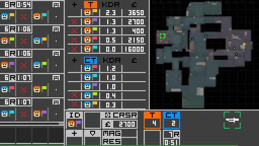

# SiDeGame - Simplified Defusal Game

*SiDeGame* is an asynchronous environment for training and evaluating AI agents
in a cooperation- and communication-based competitive setting, designed to be
consistent across human and AI interfaces.


## Disclaimer

*SiDeGame* is inspired by
[Counter-Strike: Global Offensive](https://store.steampowered.com/app/730/CounterStrike_Global_Offensive/).

Due to technical limitations of distributed AI training processes,
particularly the restriction of environment simulations to CPU,
*SiDeGame* was created as a kind of a 2D imitation,
but aiming to preserve many of the original characteristics,
resulting in a pseudo-FPS experience with top-down view.

The game rules and balancing values were either obtained through various
sources on the internet, approximated through experimentation, or otherwise changed.
Note that many aspects of the game do not translate well to a 2D setting.
Most obviously, the loss of verticality limits the map pool
and how the world can be perceived.

Some assets from CSGO were retained. For example, an old radar image of `de_cache`
was modified and repurposed as a base for the in-game world, while a subset of
original game sounds was either copied or slightly modified. Additionally,
the positional audio implementation relies on data from
[The FABIAN head-related transfer function data base](http://dx.doi.org/10.14279/depositonce-5718.5).
All other assets, such as icons, sprites, the HUD, etc. were made by me.

Unless explicitly referenced in specific docstrings or notes in development notebooks,
the code is of my own making. Systems, such as positional audio or multiplayer networking,
were based on comments or documents written by Valve or members of online communities,
but did not build on any specific code.


## Installation

Start by downloading or cloning this repository.

If you already have `python` on your system, the packages listed in
`requirements.txt` should have their dependencies met or handled during setup,
but `pysdl2` and `pyaudio` might need some prior attention.


### Dependencies of dependencies

On Linux, you may need to execute the following:

```bash
sudo apt install libsdl2-dev libsdl2-2.0-0
sudo apt install portaudio19-dev
```

Should `pyaudio` fail to install on Windows, you could try installing it from a
[wheel](https://www.lfd.uci.edu/~gohlke/pythonlibs/#pyaudio).
If suggested by the error message, you might also need to install the
[Visual C++ build tools](https://visualstudio.microsoft.com/visual-cpp-build-tools/)
or [Visual C++ redistributables](https://support.microsoft.com/en-us/topic/the-latest-supported-visual-c-downloads-2647da03-1eea-4433-9aff-95f26a218cc0).

See the project descriptions of [pysdl2](https://pypi.org/project/PySDL2/)
and [pyaudio](https://people.csail.mit.edu/hubert/pyaudio/) for more details.


### `sdglib`

Note that `sidegame` relies on a small extension of its own.
In `sidegame/ext`, you can find multiple binary files:
- `sdglib37.pyd` (Windows)
- `sdglib39.pyd` (Windows)
- `sdglib37.so` (Linux)

These pre-built binaries are reflective of the platforms and versions of `python`
on which `sidegame` was developed and tested. If you are using a different
combination, source files `lib.rs` and `Cargo.toml` are also provided to allow
you to compile `sdglib` yourself by following the instructions for
[building Rust packages](https://doc.rust-lang.org/cargo/commands/cargo-build.html)
and [building with PyO3](https://pyo3.rs/v0.13.2/building_and_distribution.html).

Determine or build the appropriate binary file and rename it to
`sdglib.pyd` (Windows) or `sdglib.so` (Linux).


### Editable install

Afterwards, `sidegame` can be installed (in editable/development mode)
from the `sidegame-py` directory with:

```bash
pip install -e .
```

More streamlined methods of installation may be made available in the future,
e.g. in the form of wheels and/or a PyPI distribution.


## Running

### Human user interface

Assuming that `sidegame-py` is the current working directory,
run this command to establish a game session:

```bash
python run_server.py
```

To connect to it and play, clients should be run from separate terminal tabs/windows
or remote machines (if the network configuration allows it) with the following:

```bash
python run_client.py
```

The matchmaking server and replay client can be launched similarly. Note that
the latter does not require a server to bind to, but rather a pre-recorded
demo (network message history).


#### Parameter configuration

There are multiple ways to override default launch parameters.
The order of priority is as follows:
1. In-terminal argument specification
2. Selected or default sub-configuration in `user_data/config.json`
3. Defaults of the parser in `name-of-script.py`

Editing or adding a sub-configuration to `config.json` should be the most
convenient way to simplify repeated launches in customised settings.
In any case, you can execute `python name-of-script.py --help`
for details on optional arguments.


#### Controls and in-game commands

The controls adhere to the following scheme:


As a basic measure of organisation, clients are assigned a role, which
determines their privileges, i.e. available in-game commands in a session.
Additionally, there are some local commands, which do not interact with the
server and can be used freely.

0. Local commands:
    - `mouse`: Toggle whether the system mouse cursor is hidden and restricted to the window.
    - `stats`: Print out the summary of statistics if stat tracking is turned on.
    - `exit`: End (own) client process.

1. Spectator commands:
    - `set role ABCDEFGH`: Set role corresponding to an 8-character (hex) key.
    - `set name ABCD`: Change name to a 4-character string (of select characters).

2. Player commands:
    - `set team B`: Move yourself to team (group) `B`, i.e. `T`, `CT`, or `S`.
    - `ping`: Print out the round-trip latencies of all active players in the match.

3. Admin commands:
    - `set team A B`: Move client with ID `A` to team (group) `B`.
    - `start`: Start the match.
    - `stop`: Stop the match.
    - `quit`: End the session, and both server and each connected client process along with it.
    - `dev mode`: Enable buying of items regardless of money, match phase, or distance to the spawn point,
    and prevent incoming damage from affecting health points.
    - `max money`: Set money to its cap value.
    - `rundown`: Run down the timer for the buy or main (plant) phase.


### AI actor interface

Actor implementations can inherit from the `sidegame.game.client.base::SDGLiveClientBase`
class and facilitate interaction with a pre-trained model, remote inference or
optimisation servers, etc.

Examples can be viewed in the form of `sdgai.actor::SDGSimpleActor` and
`sdgai.actor::SDGRemoteActor`. They can be used with `models/pcnet-sl`,
a model trained with imitation learning via `run_supervised.py`,
although highly overfitted and not very useful in practice.


### Notes on performance

At its base resolution (`256x144`), `sidegame` should be able to be rendered
at hundreds of FPS (on average - drops can still occur), which should
make it light enough to not be a bottleneck in distributed AI training processes
(network and device synchronisation should probably play a larger role).

For human interfaces, it is expected to be upscaled to higher resolutions, where
FPS is effectively limited by the argument `render_scale`. For example, scale
`4` corresponds to a resolution of `1024x576`, which should run with steady
120FPS, and scale `5` (`1280x720`) with upwards of 60FPS, while scale `6.25`
(`1600x900`) may already drop to 50FPS and below (with target tick rate of `60`).

This is caused by increased demand on the CPU to copy the original (`256x144`)
rendered frame into the pixels of a larger window to be displayed. Therefore,
these performance numbers will vary and depend on the capabilities (and active
load) of your CPU.

Additionally, going above 144FPS is not recommended, because it seems that
resources start to be taken away from the audio streaming thread in the background
(subject to Python's [GIL](https://docs.python.org/3/library/threading.html))
and sounds may become choppy. This does not have to be an issue in AI actors,
because audio processing can be explicitly stepped at the time of rendering.


### Notes on networking

Allowing clients and servers to communicate within your network may require
you to configure the Firewall settings on participating devices, set up
port forwarding, etc.


## Backlog

- Prevent FPS drops and sound tearing in situations with many simultaneous effects
by e.g. disregarding effects out of line of sight and optimising effect handling in general.

- Add checksums or something that would validate packet structure and content wrt. current
state of the match and participants before it is attempted to be unpacked and applied.

- Add a time scale option and means to convey it between server and clients.
If a change occurs while running, FPS/tick rates need to be changed accordingly.

- Enable spawning and despawning of dummy entities on the server for testing,
i.e. still player bots detached from clients.

- Allow clients to gracefully disconnect, i.e. without the server having to
handle a disconnection or timeout error.

- Allow disconnected clients to reconnect and resume their state
instead of automatically clearing associated data/objects on disconnection.

- Implement "kick player" command, i.e. disconnect them, clear their node,
and blacklist their address in the data receiving step.

- Use hashes, e.g. `sha256`, (or something that would protect data in transit as well)
for role (or user) credentials instead of clear text.

- Detach UI from server login, i.e. show window and enable the console (lobby)
before searching for and connecting to a session.


## More screenshots




## Citation

`sidegame-py` was created in the scope of my master's thesis, which will be
linked to shortly. The latter was not written in English, hence English papers
and/or documentation could still be forthcoming.
