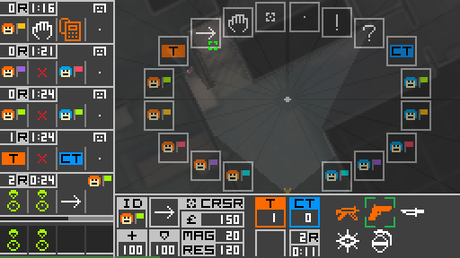
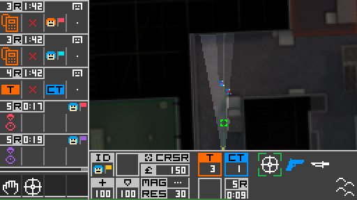

# SiDeGame - Simplified Defusal Game

*SiDeGame* is an asynchronous environment for training and evaluating AI agents
in a cooperation- and communication-based competitive setting, designed to be
consistent across human and AI interfaces.

<p float="center">
  
   
</p>

<p float="center">
  
   
</p>


## Disclaimer

*SiDeGame* is inspired by
[Counter-Strike: Global Offensive](https://store.steampowered.com/app/730/CounterStrike_Global_Offensive/).

Due to technical limitations of distributed AI training processes,
particularly the restriction of environment simulations to CPU,
*SiDeGame* was created as a kind of a 2D imitation,
but aiming to preserve many of the original characteristics,
resulting in a pseudo-FPS experience with top-down view.

The game rules and balancing values were either obtained through various
sources on the internet, approximated through experimentation, or otherwise changed.
Note that many aspects of the game do not translate well to a 2D setting.
Most obviously, the loss of verticality limits the map pool
and how the world can be perceived.

Some assets from CSGO were retained. For example, an old radar image of `de_cache`
was modified and repurposed as a base for the in-game world, while a subset of
original game sounds was either copied or slightly modified. Additionally,
the positional audio implementation relies on data from
[The FABIAN head-related transfer function data base](http://dx.doi.org/10.14279/depositonce-5718.5).
All other assets, such as icons, sprites, the HUD, etc. were made by me.

Unless explicitly referenced in specific docstrings or notes in development notebooks,
the code is of my own making. Systems, such as positional audio or multiplayer networking,
were based on comments or documents written by Valve or members of online communities,
but did not build on any specific code.


## Installation

Start by downloading or cloning this repository.

If you already have `python` on your system, the packages listed in
`requirements.txt` should have their dependencies met or handled during setup,
but `pysdl2` and `pyaudio` might need some prior attention.


### Dependencies of dependencies

On Linux, you may need to execute the following:

```bash
sudo apt install libsdl2-dev libsdl2-2.0-0
sudo apt install portaudio19-dev
```

Should `pyaudio` fail to install on Windows, you could try installing it from a
[wheel](https://www.lfd.uci.edu/~gohlke/pythonlibs/#pyaudio).

See the project descriptions of [pysdl2](https://pypi.org/project/PySDL2/)
and [pyaudio](https://people.csail.mit.edu/hubert/pyaudio/) for more details.


### Editable install

Afterwards, `sidegame` can be installed (in editable/development mode)
from the `sidegame-py` directory with:

```bash
pip install -e .
```

More streamlined methods of installation may be made available in the future,
e.g. in the form of wheels and/or a PyPI distribution.


## Running

### Human user interface

Assuming that `sidegame-py` is the current working directory,
run this command to establish a game session:

```bash
python run_server.py
```

To connect to it and play, clients should be run from separate terminal tabs/windows
or remote machines (if the network configuration allows it) with the following:

```bash
python run_client.py
```

The matchmaking server and replay client can be launched similarly. Note that
the latter does not require a server to bind to, but rather a pre-recorded
demo (network message history).


#### Parameter configuration

There are multiple ways to override default launch parameters.
The order of priority is as follows:
1. In-terminal argument specification
2. Selected or default sub-configuration in `user_data/config.json`
3. Defaults of the parser in `name-of-script.py`

Editing or adding a sub-configuration to `config.json` should be the most
convenient way to simplify repeated launches in customised settings.
In any case, you can execute `python name-of-script.py --help`
for details on optional arguments.


#### Controls and in-game commands

The controls adhere to the following scheme:


As a basic measure of organisation, clients are assigned a role, which
determines their privileges, i.e. available in-game commands in a session.
Additionally, there are some local commands, which do not interact with the
server and can be used freely.

0. Local commands:
    - `mouse`: Toggle whether the system mouse cursor is hidden and restricted to the window.
    - `stats`: Print out the summary of statistics if stat tracking is turned on.
    - `exit`: End (own) client process.

1. Spectator commands:
    - `set role ABCDEFGH`: Set role corresponding to an 8-character (hex) key.
    - `set name ABCD`: Change name to a 4-character string (of select characters).

2. Player commands:
    - `set team B`: Move yourself to team (group) `B`, i.e. `T`, `CT`, or `S`.
    - `ping`: Print out the round-trip latencies of all active players in the match.

3. Admin commands:
    - `set team A B`: Move client with ID `A` to team (group) `B`.
    - `start`: Start the match.
    - `stop`: Stop the match.
    - `quit`: End the session, and both server and each connected client process along with it.
    - `dev mode`: Enable buying of items regardless of money, match phase, or distance to the spawn point,
    and prevent incoming damage from affecting health points.
    - `max money`: Set money to its cap value.
    - `rundown`: Run down the timer for the buy or main (plant) phase.


### AI actor interface

Actor implementations can inherit from the `sidegame.game.client.base::SDGLiveClientBase`
class and facilitate interaction with a pre-trained model, remote inference or
optimisation servers, etc.

Examples can be viewed in the form of `sdgai.actor::SDGSimpleActor` and
`sdgai.actor::SDGRemoteActor`. They can be used with `models/pcnet-sl.pth`,
a model trained with imitation learning via `run_supervised.py`,
although highly overfitted and not very useful in practice.


### Notes on performance

At its base resolution (`256x144`), `sidegame` should be able to be rendered
at hundreds of FPS (on average - drops can still occur), which should
make it light enough for AI training setups. In distributed setups,
note that network and device synchronisation also play a role.

For human interfaces, it is expected to be upscaled to higher resolutions,
using the argument `render_scale`. Here are a few scale-to-resolution correspondences:
- `4` -- `1024x576`
- `5` -- `1280x720`
- `6.25` -- `1600x900`
- `7.5` -- `1920x1080`
- `10` -- `2560x1440`

Presently, going above 144FPS is not recommended, because it seems that
resources start to be taken away from the audio streaming thread in the background
(subject to Python's [GIL](https://docs.python.org/3/library/threading.html))
and sounds may become choppy. This does not have to be an issue in AI actors,
because audio processing can be explicitly stepped at the time of rendering.


### Notes on networking

Allowing clients and servers to communicate within your network may require
you to configure the Firewall settings on participating devices, set up
port forwarding, etc.


## More screenshots

<p float="center">
  
   
</p>

<p float="center">
  
   
</p>

<p float="center">
  
   
</p>

<p float="center">
  
   
</p>


## Citation

`sidegame-py` was created in the scope of my [master's thesis](https://plus.si.cobiss.net/opac7/bib/75138819) (in Slovene):

```
@article{Puc_2021,
 title={Online benchmark environment for multi-agent reinforcement learning: Master's thesis},
 author={Puc, Jernej},
 year={2021},
 url={https://repozitorij.uni-lj.si/IzpisGradiva.php?lang=eng&id=129594}}
```

A much shorter [conference paper](https://plus.si.cobiss.net/opac7/bib/86401795) is available in English:

```
@inproceedings{Puc_Sadikov_2021,
 title={SiDeGame: An Online Benchmark Environment for Multi-Agent Reinforcement Learning},
 author={Puc, Jernej and Sadikov, Aleksander},
 booktitle={Slovenian Conference on Artificial Intelligence, Proceedings of the 24th international multiconference: Information Society - IS 2021, volume A},
 publisher={Institute Jožef Stefan},
 editor={Luštrek, Mitja and Gams, Matjaž and Piltaver, Rok},
 ISBN={2630-371X},
 ISSN={2630-371X},
 year={2021},
 month={oct},
 pages={35–38},
 url={http://library.ijs.si/Stacks/Proceedings/InformationSociety/2021/IS2021_Volume_A.pdf}}
```

After a new round of updates and reinforcement learning experiments is concluded,
another paper will be forthcoming.


## Going forward

Despite a year of inactivity, the prospect of revisiting SiDeGame remains.
The following open issues are being addressed in 2023:


#### Gameplay
- Make matches shorter, with fewer rounds (e.g. BO15 instead of BO30, no draws).
- Add more maps by modifying the original map for different team sizes:
  1v0 (aim practice), 1v1, 2v2, 3v3, 4v4, 5v5 (existing/original).

#### Optimisation
- Use numba to optimise physics, logic, and drawing wherever possible and beneficial.
- Use asyncIO to prevent client-server communication from blocking the client loop.
- Define a custom warping method to fix the graphical artifacts of visual effects.
- Perform a distance check and line-of-sight masking before drawing visual effects.

#### User interface
- Use asyncIO to prevent window rendering from blocking the client loop.
- Use asyncIO to avoid the need for a separate thread to write to the audio stream.
- Allow the client loop to run regardless of server connection,
  rendering the console/lobby view.

#### Networking
- Add an event to signal the server to handle intended disconnections
  immediately instead of eventually catching a timeout or related errors.
- Keep the state of unexpectedly disconnected clients and allow them to resume from it
  if they manage to reconnect.
- Implement a fused AI client-server that can run several match sessions
  in lockstep (synchronous) mode.

#### Security
- Add options for the server to update and search through a list of allowed and blocked IPs.

#### Matchmaking
- Add options for the client to update and search through a list of known server IPs.
- Add "kick player" admin command to disconnect them, clear their node,
  and place their address on a temporary blacklist.

#### Data extraction
- Add option to produce segmentation maps for every frame.

#### AI agents
- Remove current imitation learning implementation and model.
- Revise the policy and valuator model architectures.
- Revise the RL implementation for the lockstep setting and update the algorithm to PPG
([`discit`](https://github.com/jernejpuc/discit)).
- Pretrain the visual encoder part of the model on frame-segmentation pairs.
- Add trained policy models for each stage of a curriculum of transferring agents
  from smaller to larger maps and team sizes.

#### Presentation
- Record demos of human and AI play and embed uploaded videos on the front page.
