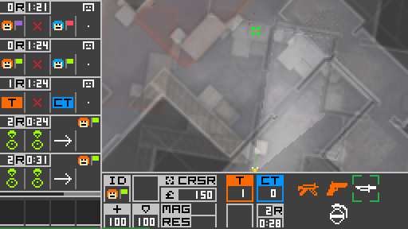

# SiDeGame - Simplified Defusal Game

*SiDeGame* is an asynchronous environment for training and evaluating AI agents
in a cooperation- and communication-based competitive setting, designed to be
consistent across human and AI interfaces.


## Disclaimer

*SiDeGame* is inspired by
[Counter-Strike: Global Offensive](https://store.steampowered.com/app/730/CounterStrike_Global_Offensive/).

Due to technical limitations of distributed AI training processes,
particularly the restriction of environment simulations to CPU,
*SiDeGame* was created as a kind of a 2D imitation,
but aiming to preserve many of the original characteristics,
resulting in a pseudo-FPS experience with top-down view.

The game rules and balancing values were either obtained through various
sources on the internet, approximated through experimentation, or otherwise changed.
Note that many aspects of the game do not translate well to a 2D setting.
Most obviously, the loss of verticality limits the map pool
and how the world can be perceived.

Some assets from CSGO were retained, e.g. the radar-based world map and game sounds,
and the positional audio implementation relies on data from
[The FABIAN head-related transfer function data base](http://dx.doi.org/10.14279/depositonce-5718.5).
Otherwise, unless explicitly referenced, the assets and code are of my own making.
Systems, such as positional audio or multiplayer networking,
were based on documents written by Valve or members of the online community,
but did not build on any specific code.


## Installation

Start by downloading or cloning this repository.

If you already have `python` on your system, most of the packages listed in
`requirements.txt` should have their dependencies met or handled during setup.
Exceptions (on Linux) are `pysdl2` and `pyaudio`, which (might) need you to
execute the following:

```bash
sudo apt install libsdl2-dev libsdl2-2.0-0
sudo apt install portaudio19-dev
```

See the project descriptions of [pysdl2](https://pypi.org/project/PySDL2/)
and [pyaudio](https://people.csail.mit.edu/hubert/pyaudio/) for more details.

Note that `sidegame` relies on a small library of its own.
In `sidegame/ext`, you can find multiple binary files:
- `sdglib37.pyd` (Windows)
- `sdglib39.pyd` (Windows)
- `sdglib37.so` (Linux)

These pre-built binaries are reflective of the platforms and versions of `python`
on which `sidegame` was developed and tested. If you are using a different
combination, source files `lib.rs` and `Cargo.toml` are also provided to allow
you to compile `sdglib` yourself by following the instructions for
[building Rust packages](https://doc.rust-lang.org/cargo/commands/cargo-build.html)
and [building with PyO3](https://pyo3.rs/v0.13.2/building_and_distribution.html).

Determine or build the appropriate binary file and rename it to
`sdglib.pyd` (Windows) or `sdglib.so` (Linux).

Afterwards, `sidegame` can be installed (in editable/development mode)
from the `sidegame-py` directory with:

```bash
pip install -e .
```

More streamlined methods of installation may be made available in the future,
e.g. in the form of wheels and/or a PyPI distribution.


## Running

### Human user interface

Assuming that `sidegame-py` is the current working directory,
run this command to establish a game session:

```bash
python run_server.py
```

To connect to it and play, clients should be run from separate terminal tabs/windows
or remote machines (if the network configuration allows it) with the following:

```bash
python run_client.py
```

The matchmaking server and replay client can be launched similarly. Note that
the latter does not require a server to bind to, but rather a pre-recorded
demo (network message history).

There are multiple ways to override default launch parameters.
The order of priority is as follows:
1. In-terminal argument specification
2. Selected or default sub-configuration in `user_data/config.json`
3. Defaults of the parser in `name-of-script.py`

Editing or adding a sub-configuration to `config.json` should be the most
convenient way to simplify repeated launches in customised settings.
In any case, you can execute `python name-of-script.py --help`
for details on the optional arguments.


### AI actor interface

Actor implementations can inherit from the `sidegame.game.client.base::SDGLiveClientBase`
class and facilitate interaction with a pre-trained model, remote inference or
optimisation servers, etc.

An example implementation can be viewed in a separate, though related, repository (WIP).


### Notes on performance

At its base resolution (`256x144`), `sidegame` is capable of being rendered
at several hundreds of (average) FPS, which should make it light enough to not be a
bottleneck in distributed AI training processes (network and device synchronisation
should probably play a larger role).

For human interfaces, it is expected to be upscaled to higher resolutions, where
FPS is effectively limited by the argument `render_scale`. For example, scale
`4` corresponds to a resolution of `1024x576`, which should run with steady
120FPS, and scale `5` (`1280x720`) with upwards of 60FPS, while scale `6.25`
(`1600x900`) may already drop to 50FPS and below (with target tick rate of `60`).

This is caused by increased demand on the CPU to copy the original (`256x144`)
rendered frame into the pixels of a larger window to be displayed. Therefore,
these performance numbers will vary and depend on the capabilities (and active
load) of your CPU.

Additionally, going above 144FPS is not recommended, because it seems that
resources start to be taken away from the audio streaming thread in the background
(subject to Python's [GIL](https://docs.python.org/3/library/threading.html))
and sounds may become choppy. This does not have to be an issue in AI actors,
because audio processing can be explicitly stepped at the time of rendering.


### Notes on networking

Allowing clients and servers to communicate within your network may require
you to configure the Firewall settings on participating devices, set up
port forwarding, etc.


## Backlog

- Add checksums or something that would validate packet structure and content wrt. current
state of the match and participants before it is attempted to be unpacked and applied.

- Add a time scale option and means to convey it between server and clients.
If a change occurs while running, FPS/tick rates need to be changed accordingly.

- Enable spawning and despawning of dummy entities on the server for testing,
i.e. still player bots detached from clients.

- Allow disconnected clients to reconnect and resume their state
instead of automatically clearing associated data/objects on disconnection.

- Implement "kick player" command, i.e. disconnect them, clear their node,
and blacklist their address in the data receiving step.

- Use hashes, e.g. `sha256`, (or something that would protect data in transit as well)
for role (or user) credentials instead of clear text.

- Detach UI from server login, i.e. show window and enable the console (lobby)
before searching for and connecting to a session.


## More screenshots





## Cleanup

1. upload to github private repo
2. upload password-protected zip to drive
